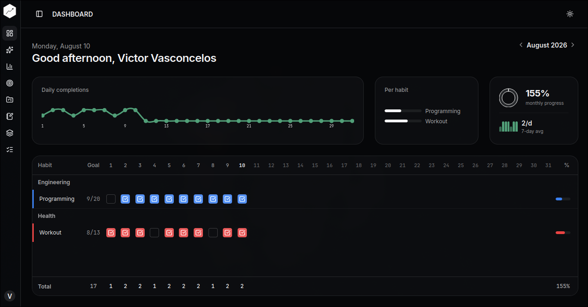

<div align="center">


# LifeOS

> Build a life you can measure, understand, and improve.

A web app for tracking habits, goals and projects, understanding how your days actually go, and
slowly building a life you can measure, understand and improve.

<p align="center">

[](https://github.com/vvasconceloss/lifeos/actions/workflows/ci.yml)
[](LICENSE)
[](CHANGELOG.md)
[](https://www.typescriptlang.org/)
[](https://react.dev/)
[](https://www.postgresql.org/)
[](CHANGELOG.md)
[](https://github.com/vvasconceloss/lifeos/pulls)
[](docs/features/INTERNATIONALIZATION.md)

</p>

</div>

**v1.6.0 (Account Security, Lifecycle & i18n) is released**: a strong password policy, email
verification, password recovery, password/email changes, account soft-delete with a 15-day recovery
window, and full internationalization (English, Portuguese, Ukrainian) — see
[`docs/README.md`](docs/README.md) as the documentation entry point (roadmap, domain rules,
frequencies, gamification, ops, deployment, security), the [`CHANGELOG.md`](CHANGELOG.md) for the
release history, and [`docs/roadmap/v1.6_ACCOUNT_SECURITY.md`](docs/roadmap/v1.6_ACCOUNT_SECURITY.md)
for the phase-by-phase roadmap.

---

## Demo

Try it live from the [landing page](https://lifeos.app) — the **View Demo** button logs you into a
public demo account (`demo@lifeos.com`) pre-loaded with realistic data.



---

## Features

- **Pillars** — organize your life into areas (Health, Engineering, Relationships, …) with icons,
  colors and descriptions.
- **Habits** — flexible frequencies (daily, specific days, X times per week/month), icons, colors,
  archiving and an individual history calendar with current/best streaks.
- **Goals** — outcomes linked to supporting habits, with progress derived from real completions.
- **Projects & Tasks** — structured work with a task checklist; progress updates automatically.
- **Daily Journal** — log mood, energy, sleep (hours + minutes) and notes; see how your logged days
  distribute across mood, energy and sleep buckets.
- **Analytics** — Insights (trends, consistency, focus areas) and Statistics (monthly summary,
  per-pillar, heatmap).
- **Onboarding** — a guided first-run flow with default areas and suggested habits (skippable).
- **Gamification** — optional XP/levels/ranks derived transparently from real progress (off by
  default).
- **Personalization** — theme (light/dark/system), timezone, week-start, profile.
- **Internationalization** — full UI in English, Portuguese and Ukrainian, selectable from the
  profile and the landing page (instant switch, persisted across sessions and devices).
- **Account security** — strong password policy, email verification, password recovery,
  password/email changes with current-password confirmation, and account soft-delete with a
  15-day recovery window (see [SECURITY.md](SECURITY.md) and
  [docs/SECURITY_AUDIT.md](docs/SECURITY_AUDIT.md)).

---

## Tech Stack

- Node.js + TypeScript + Fastify (API)
- React + TypeScript + Vite (Web)
- PostgreSQL + Prisma (data layer)
- Zod (shared validation between API and Web)
- Vitest + Testing Library + MSW (tests), Sentry (web error tracking, opt-in)
- pnpm workspaces (monorepo)
- Deployed on Render (API) + Vercel (web) + Neon (PostgreSQL)

---

## Architecture

```text
Browser (React SPA)
   │ HTTPS — same origin
   ▼
Vercel  — static build · rewrites /v1/*  →  Render
                                        ▼
                           Fastify API (Node)
                           auth · csrf · validation · services · /docs (Swagger UI)
                                        ▼
                           Prisma (pg pool · migrations)
                                        ▼
                           Neon PostgreSQL (managed)
```

- **Authentication:** JWT in an HTTP-only cookie (`SameSite=Strict`, `Secure`, 30-day expiry).
  Sensitive account changes invalidate other sessions; tokens (verification, reset, email change,
  deletion) are single-use, expiring, and stored only as SHA-256 hashes.
- **Validation:** shared Zod schemas (`packages/shared`) at every boundary.
- **CI:** GitHub Actions — lint → test (coverage) → i18n check → build → dependency audit.

Data model (summary):

```text
User ─┬─ Pillars ── Habits ── HabitCompletions
      ├─ Goals ── GoalHabit (N:N) ── Habits
      ├─ Projects ── ProjectTasks
      └─ DailyLogs
```

Full diagram, ERD and the architectural decision records (ADRs):
[`docs/architecture/008-diagrams.md`](docs/architecture/008-diagrams.md) ·
[ADRs](docs/architecture/001-monorepo.md)

---

## Project Structure

```
lifeos/
│
├── apps/
│   ├── api/            # Fastify API (modules: auth, pillars, habits, completions, goals,
│   │                   #   projects, daily-logs, stats, progression)
│   │   ├── src/
│   │   └── prisma/     # schema + migrations
│   └── web/            # React + Vite SPA
│       └── vercel.json # /v1 proxy to the API + SPA fallback
│
├── packages/
│   └── shared/         # shared zod schemas and types
│
├── docs/               # roadmap, domain rules, frequencies, gamification, security, ops, deployment
├── .github/workflows/  # CI + Render keep-alive
├── render.yaml         # Render blueprint (API)
├── pnpm-workspace.yaml
└── tsconfig.base.json
```

---

## Getting Started (development)

### Requirements

- Node.js 22+
- pnpm
- PostgreSQL (or Docker)

### Setup

```bash
git clone https://github.com/vvasconceloss/lifeos.git
cd lifeos
pnpm install
```

Start PostgreSQL (Docker):

```bash
docker compose up -d
```

Prepare the database and generate the Prisma client:

```bash
cp apps/api/.env.example apps/api/.env   # set DATABASE_URL and JWT_SECRET
pnpm db:migrate                          # applies migrations
pnpm prisma:generate
```

Run the API (port 3000) and the web app (port 5173) in two terminals:

```bash
pnpm --filter @lifeos/api dev
pnpm --filter @lifeos/web dev
```

---

## Testing, Lint and Build

```bash
pnpm lint     # eslint across api, web and shared
pnpm test     # API tests (363, requires PostgreSQL) + Web integration tests (90)
pnpm build    # typecheck/build api and web
```

Extra quality checks:

```bash
pnpm --filter @lifeos/web i18n:check   # fails if a translation key is missing in any language
pnpm test:coverage                      # fails below the coverage thresholds
```

---

## CI

`.github/workflows/ci.yml` runs install, Prisma generate + migrations, lint, tests, the i18n
key-completeness check and build on every pull request and push to `main`, using a Postgres service
container. The API suite includes an E2E main-flow test (register → create pillar → create habit →
complete habit → dashboard reflects progress).

---

## Deployment

Production architecture:

```
Browser → https://<app-domain>/v1/*  →  (rewrite)  →  https://<api-domain>/v1/*
            https://<app-domain>/*   →  SPA index.html
```

- **PostgreSQL — Neon** (free): managed Postgres with point-in-time restore.
- **API — Render** (free): `render.yaml` builds `@lifeos/api`, starts `node dist/server.js`, and runs
  `prisma migrate deploy` before each deploy. Health check at `/v1/health/ready`. A GitHub Actions
  keep-alive pings `/v1/health` to prevent the free instance from sleeping.
- **Web — Vercel** (free): Root Directory `apps/web`, `pnpm build`, output `dist`. The
  `apps/web/vercel.json` rewrites `/v1/*` to the API domain and falls back to `index.html` for
  client-side routes (same-origin, so auth cookies stay `SameSite=Strict` and `Secure`).

Full environment variables, first-deploy and rollback steps: [`docs/ops/DEPLOYMENT.md`](docs/ops/DEPLOYMENT.md).

---

## License

This project is licensed under the MIT License.
